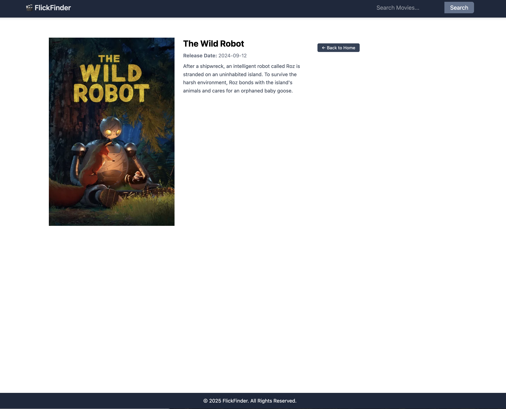

# 🎬 FlickFinder

FlickFinder is a movie discovery web application that allows users to search for films, browse top-rated titles, and explore what’s currently in theaters or coming soon. Built as a modern single-page application using React, Redux Toolkit, Tailwind CSS, and the TMDb API, FlickFinder offers a smooth, responsive user experience for film lovers.

### [Live Demo 🌐](https://flick-finder-five.vercel.app)

## Features
* Search for movies using keywords
* Browse "Now Playing", "Popular", and "Coming Soon" carousels
* View detailed movie information
* Smooth navigation using React Router
* Animated search results using Framer Motion
* Fully responsive UI styled with Tailwind CSS

## Technology Stack
* React (SPA with react-router-dom)
* Redux Toolkit (createAsyncThunk for API calls)
* Tailwind CSS (styling)
* Framer Motion (animations)
* Swiper (carousel sliders)
* TMDb API (movie data)


## How to Run Locally
1. Clone the repository:
  ```
  git clone https://github.com/your-username/flickfinder.git
  cd flickfinder
  ```
2. Install dependencies:
  ```
  npm install
  ```
3. Set up environment variables:
  Create a .env file and add your TMDb API key:
  ```
  VITE_MOVIE_API_KEY=your_tmdb_api_key_here
  ```
4. Start the development server:
  ```
  npm run dev
  ```
5. Open http://localhost:5173 to view the app in your browser.

<details>
  <summary>Screenshots</summary>

  ### Home Page  
  

  ### Search Result   
  

  ### Movie Detail Page  
  

</details>

## Responsible Use of AI
#### I used AI to help me:
* Understand how to structure my React components using props and useState
* Debug fetch requests to the TMDb API and handle edge cases
* Learn how to correctly implement createAsyncThunk with Redux Toolkit
#### Throughout the project, I made sure to learn from the AI guidance and review the code I implemented to understand how it works, rather than copying without context.

## Stretch Goals
#### If I had more time to continue building out FlickFinder, I would expand its features to include:
✵ User Authentication
* Add login and signup functionality to allow users to create an account, log in, and access a personalized dashboard.

✵ Cast Section on Movie Details
* Display a list of cast members with their names, character roles, and profile images from the TMDb API.

✵ "Save to Favorites" Feature
* Let users save movies they love to a personal favorites list for later viewing.

✵ Dedicated Component Pages with Recommendations
* Move each movie category (e.g., Popular, Now Playing) to its own route and page. At the bottom of each page, include a related movie recommendation that the user can add to their list.

#### These stretch goals would make FlickFinder a more personalized, interactive, and immersive experience for movie enthusiasts.